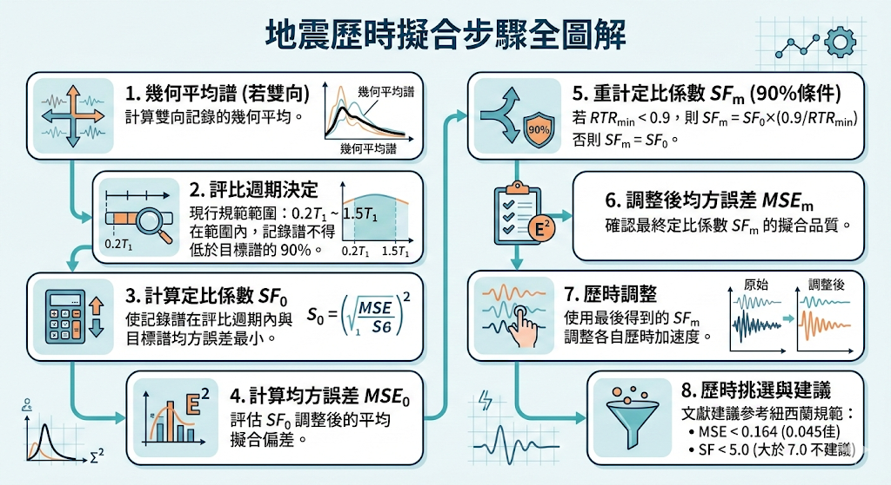

import WarningBox from "../../../components/WarningBox.astro";

在[反應譜擬合方法](./2026-03-matchingmethod)中提及數個方法。振幅放大法為其中較簡易之方法，依國震中心文獻的[INMOST - 臺灣工址輸入地震查選平台](https://seaport.ncree.org/inmost/)亦採振幅放大法[^1]。後續依照該文獻整理出振幅放大法的計算流程。

# 振幅放大法
振幅放大法為透過求得擬合反應譜與目標反應譜之差異，由差異的比值進行放大，放大的係數稱為定比係數SF去調整，同時也計算均方誤差MSE瞭解擬合程度[^1]。

## 擬合步驟

1. 如果雙向歷時，要做幾何平均譜來擬合。最後將兩向反應譜同乘同一定比係數。

2. 評比週期決定，現行規範為$0.2T_1 - 1.5T_1$，在評比週期內滿足規範規定不得低於目標反應譜之90%。

3. 計算定比係數$SF_0$

	$\begin{aligned} SF_0 = \exp \{\frac{\sum_{i}^{N}[ \ln(Sa_{target}(T_i)) - \ln(Sa_{record}(T_i)) ] }{N} \} \end{aligned}$

	其中,

	$T_i$ : 評比週期範圍內之第i個週期值

	$N$​ : 評比週期點總數

	$Sa_{target}$ : 目標反應譜之Sa值

	$Sa_{record}$ : 紀錄反應譜之Sa值

4. 計算均方誤差$MSE_0$

	$\begin{aligned} MSE_0 = \frac{\sum_{i}^{N}[ \ln(Sa_{target}(T_i)) - \ln(Sa_{record}(T_i) \times SF_0) ]^2 }{N} \end{aligned}$

5. 因90%條件，重新計算定比係數$SF_m$

    $SF_{m}= \begin{cases} SF_{0} \times (0.9/{RTR}_{min}) &, \quad {RTR}_{min}<0.9 \\ SF_{0} &, \quad {RTR}_{min} \ge 0.9 \\ \end{cases}$

		其中,

    ${RTR}_{min}=min(\frac{{Sa}_{record}(T_i) \times{SF}_{0}} {{Sa}_{target}(T_i)} )$

    ${RTR}_{min}表示為評比週期範圍內經SF_{0}$調整之$Sa_{record}$對$Sa_{target}$的所有比例的最小值。

6. 調整後均方誤差$MSE_m$

    $\begin{aligned} MSE_m = \frac{\sum_{i}^{N}[ \ln(Sa_{target}(T_i)) - \ln(Sa_{record}(T_i) \times SF_m) ]^2 }{N} \end{aligned}$

7. 歷時調整

    由$SF_m$調整歷時。如果雙向則用$SF_m去$調整各自歷時。

8. 歷時挑選

    如果基於此方法，可以由$MSE_0$小者去挑選。文獻建議參考紐西蘭規範取MSE小於0.164 (理論上0.045為優良擬合度)，SF < 5.0 為宜，大於 7.0 不建議採用。

## 結語
國震中心該篇文獻清楚說明振幅放大法的實作過程。由實作過程中了解到振幅放大法：

**優點**
	1. 計算對於實務工程師是簡單易於計算求得。
	2. 搭配現行規範較容易處理雙向擬合問題。

**缺點**
	1. 可能失去地震原始特性。
	2. 可能產生過大放大的情況。

[^1]: 臺灣工址受震反應分析用實測地震資料庫 https://seaport.ncree.org/static/pdf/inmost/%E5%8A%89%E5%8B%9B%E4%BB%812021_%E8%87%BA%E7%81%A3%E5%B7%A5%E5%9D%80%E5%8F%97%E9%9C%87%E5%8F%8D%E6%87%89%E5%88%86%E6%9E%90%E7%94%A8%E5%AF%A6%E6%B8%AC%E5%9C%B0%E9%9C%87%E8%B3%87%E6%96%99%E5%BA%AB.pdf