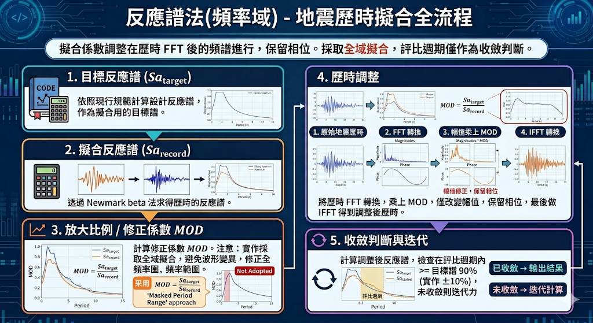

import WarningBox from "../../../components/WarningBox.astro";

在[反應譜擬合方法](./2026-03-matchingmethod)中提及數個方法。反應譜法(頻率域)在工程實務中是常見的做法，計算較快且具不錯擬合程度。以下將參考文獻[^1]流程與實際程式實作結果說明擬合方法。

# 反應譜法(頻率域)

擬合係數為擬合反應譜與目標反應譜之比值做調整，調整為在歷時的FFT後的頻譜進行調整，因此被稱作**頻率域**的調整。

## 擬合步驟

1. 目標反應譜$Sa_{target}$：
   依照現行規範計算對應之設計反應譜作為擬合用的目標反應譜。

2. 擬合反應譜$Sa_{record}$：
   透過Newmark beta法求得歷時的反應譜。

3. 放大比例：
   修正係數$MOD$為$\frac{Sa_{target}}{Sa_{record}}$。

<WarningBox type="note">
  文獻中會看到此調整為在評比週期區間內調整，因此要建立對應遮罩進行修正。不過在實作過程中發現，照此調整所得歷時可能波形變化較大，且反應譜只有評比週期內擬合。與實務認知會有落差，因此程式實作中，採取全域擬合，評比週期僅作為擬合收斂之判斷依據。
</WarningBox>

4. 歷時調整
   將地震力時進行FFT轉換，並將FFT的值乘上修正係數$MOD$。調整過程僅改變幅值，保留相位。調整完後進行IFFT得到調整後的地震歷時。

5. 收斂判斷
   計算調整後歷時的反應譜，並與目標反應譜比較，檢查在評比週期內反應譜值是否滿足規定之不得低於目標反應譜之90%。

<WarningBox type="note">
  1.
  對於收斂判斷，規範除了90%之外，沒有明確數值收斂標準。在相關文獻中有各種判斷標準，如均方誤差等。程式實作採評比週期內與目標反應譜達到正負10%即視為擬合完成。
  2.
  反應譜法(頻率域)一般作法是用固定迭代次數計算，不會有特定收斂停止標準。不過一般認知迭代10次即有很好的擬合狀態。程式實作中除了上述收斂標準外，最大迭代次數設定20次(實作發現10次可能無法滿足規範要求)。
</WarningBox>

## 結語

反應譜法(頻率域)計算上仍屬容易，又可得到不錯擬合結果，是實務上常見做法：

**優點** 1. 計算具效率。2. 可得不錯擬合結果。

**缺點** 1. 可能失去地震原始特性。

## 參考資料

其餘相關參考資料有[^2][^3][^4][^5][^6]

[^1]: Selection, Scaling And Simulation Of Input Selection, Scaling And Simulation Of Input Ground Motion For Time History Analysis Ground Motion For Time History Analysis Of Structure https://www.ce.memphis.edu/7137/pdfs/scaling/02_yasin_fahjan_presentation.pdf

[^2]: SIMULATION OF EARTHQUAKE DESIGN GROUND MOTION COMPATIBLE TO DESIGN RESPONSE SPECTRA USING GROUP DELAY TIME ENVELOP https://www.researchgate.net/publication/319301355_SIMULATION_OF_EARTHQUAKE_DESIGN_GROUND_MOTION_COMPATIBLE_TO_DESIGN_RESPONSE_SPECTRA_USING_GROUP_DELAY_TIME_ENVELOP

[^3]: A comparison among different spectrum compatible earthquake simulation methods https://oa.upm.es/15002/1/APPLIED_MATHEMATICAl_a_comparison_among.pdf

[^4]: https://repository.lib.ncsu.edu/server/api/core/bitstreams/bb1a59e4-63bd-4f7e-a5c5-8fdc94539317/content

[^5]: ON THE GENERATION OF THE DESIGN EARTHQUAKE GROUND MOTION TIME HISTORY https://www.pwri.go.jp/eng/ujnr/joint/33/paper/41okawa.pdf

[^6]: Generation Of Spectrum Compatible Accelerograms https://orbi.uliege.be/bitstream/2268/164345/2/GOSCA_ShortDescription.pdf
